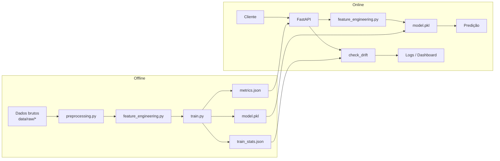

TECH CHALLENGE 5 - FIAP 

# Datathon: Case Passos Mágicos - Previsão de Risco de Defasagem Escolar

Projeto de Machine Learning Engineering para estimar risco de defasagem escolar de estudantes da Associação Passos Mágicos, cobrindo ciclo completo de MLOps: treinamento, validação, serving via API, testes, monitoramento e empacotamento com Docker.

## 1) Visão Geral do Projeto


**Objetivo de negócio**

Identificar, de forma antecipada, estudantes com maior probabilidade de risco educacional para apoiar ações pedagógicas e psicopedagógicas mais assertivas.


**Solução proposta**

Pipeline completa de ML em Python: pré-processamento, engenharia de atributos, treinamento e avaliação de modelo supervisionado, serialização com `joblib`, serving via API FastAPI e monitoramento com logs e painel de drift.


**Métrica principal de avaliação**

`F1-score` (com apoio de `accuracy`, `precision`, `recall` e `roc_auc`). O F1-score equilibra precisão e recall, sendo adequado para reduzir falsos negativos de alunos em risco sem gerar excesso de falsos positivos.


**Stack tecnológica**

| Componente     | Tecnologia                          |
|----------------|-------------------------------------|
| Linguagem      | Python 3.9+                         |
| ML             | scikit-learn, pandas, numpy         |
| API            | FastAPI + Uvicorn                   |
| Serialização   | joblib                              |
| Testes         | pytest + pytest-cov (90% cobertura) |
| Empacotamento  | Docker                              |
| Monitoramento  | logging JSON + dashboard de drift   |


## 2) Estrutura do Projeto

```bash
fiaptech5/
├── app/
│   ├── main.py               # Inicialização FastAPI e carregamento do modelo
│   ├── routes.py              # Endpoints da API (9 rotas)
│   └── model/                 # Modelo serializado (model.pkl)
├── data/
│   ├── raw/                   # Dados brutos originais
│   └── processed/             # Dados limpos para treino
├── models/
│   ├── metrics.json           # Métricas do último treino
│   └── train_stats.json       # Estatísticas para monitoramento de drift
├── src/
│   ├── preprocessing.py       # Limpeza e tratamento de dados
│   ├── feature_engineering.py # Criação e seleção de variáveis
│   ├── train.py               # Pipeline de treinamento
│   ├── evaluate.py            # Avaliação de métricas
│   └── monitoring.py          # Logging estruturado e métricas operacionais
├── tests/                     # 157 testes unitários
├── Dockerfile
├── requirements.txt
└── README.md
```


### 2.1) Diagrama da Arquitetura



## 3) Como Executar

### Com Docker (recomendado)

```bash
docker build -t passos-magicos-api .
docker run --rm -p 8000:8000 passos-magicos-api
```
### Testes de Cobertura 

```bash
.venv/bin/python -m pytest --cov=src --cov=app tests/ -v --tb=short 
```

### Localmente

```bash
pip install -r requirements.txt
python src/train.py                    # Treinar o modelo
uvicorn app.main:app --reload          # Subir a API
```

### Testes

```bash
pytest --cov=src --cov=app tests/ -v --tb=short
# 157 passed — 90% coverage
```

Acesse a API: **http://localhost:8000/docs** (Swagger UI)


## 4) Endpoints da API

| # | Método | Endpoint                     | Descrição                                             |
|---|--------|------------------------------|-------------------------------------------------------|
| 1 | POST   | `/train`                     | Executa pipeline completa de treinamento              |
| 2 | GET    | `/health`                    | Status da aplicação e do modelo                       |
| 3 | GET    | `/metrics`                   | Métricas do último treino (accuracy, F1, ROC-AUC)     |
| 4 | POST   | `/predict`                   | Predição de risco escolar                             |
| 5 | GET    | `/monitoring`                | Indicadores operacionais (requests, latência, erros)  |  
| 6 | GET    | `/monitoring/predictions`    | Histórico de predições recentes                       |
| 7 | GET    | `/drift`                     | Status do monitoramento de drift                      |
| 8 | GET    | `/drift/history`             | Histórico de alertas de drift                         |
| 9 | GET    | `/drift/dashboard`           | Painel HTML de monitoramento                          |

### Campos do `/predict`

| Campo | Tipo | Descrição                                      |
|-------|------|------------------------------------------------|
| INDE | float | Indicador de Desenvolvimento (0-10)            |
| IDA | float | Indicador de Defasagem em Alfabetização (0-10)  |
| IEG | float | Indicador de Engajamento (0-10)                 |
| IAA | float | Indicador de Assiduidade e Atendimento (0-10)   |
| IPS | float | Indicador de Participação Social (0-10)         |
| IPP | float | Indicador de Postura Pedagógica (0-10)          |
| IPV | float | Indicador de Ponto de Virada (0-1)              |
| IAN | float | Indicador de Aprendizado em Novas Áreas (0-10)  |
| FASE | int | Fase do aluno                                    |
| PEDRA | string | Pedra associada ("Quartzo", "Ametista", "Ágata", "Topázio") |

### Exemplos via cURL

**Aluno fora de risco** (indicadores altos):
```bash
curl -X POST "http://127.0.0.1:8000/predict" \
  -H "Content-Type: application/json" \
  -d '{"INDE":7.5,"IDA":8.0,"IEG":7.0,"IAA":8.5,"IPS":7.0,"IPP":7.5,"IPV":0.8,"IAN":7.5,"FASE":2,"PEDRA":"Ametista"}'
```
```json
{ "prediction": 0, "label": "fora_do_grupo_de_risco", "drift_alerts": {} }
```

**Aluno em risco** (indicadores baixos):
```bash
curl -X POST "http://127.0.0.1:8000/predict" \
  -H "Content-Type: application/json" \
  -d '{"INDE":3.0,"IDA":2.5,"IEG":3.5,"IAA":2.0,"IPS":3.0,"IPP":2.8,"IPV":0.2,"IAN":2.5,"FASE":0,"PEDRA":"Quartzo"}'
```
```json
{ "prediction": 1, "label": "em_grupo_de_risco", "drift_alerts": { "INDE": { "status": "DRIFT DETECTED" } } }
```

## 5) Etapas do Pipeline de Machine Learning

### 5.1) Pipeline de Treinamento (offline)

Executada via `python src/train.py`:

1. **Carregamento dos dados** — lê CSV/Excel/PDF de `data/raw/`; se indisponível, gera dataset sintético.
2. **Pré-processamento** (`preprocessing.py`) — normaliza colunas, remove duplicatas, trata ausentes, cria `risk_label`.
3. **Engenharia de features** (`feature_engineering.py`) — cria `avg_performance` e `low_engagement`; remove identificadores.
4. **Treinamento** (`train.py`) — split 80/20, `ColumnTransformer` + `RandomForestClassifier` via Pipeline scikit-learn.
5. **Avaliação** (`evaluate.py`) — calcula accuracy, precision, recall, F1-score e ROC-AUC.
6. **Salvamento** — persiste `model.pkl`, `metrics.json` e `train_stats.json`.

> **Seleção de modelo:** RandomForestClassifier, por equilibrar performance, interpretabilidade e facilidade de deploy.

### 5.2) Pipeline de Serviço (API)

1. **Inicialização** — carrega `model.pkl` e `train_stats.json`; se ausente, treina modelo fallback em memória.
2. **Predição** (`POST /predict`) — valida entrada via Pydantic, reaplica feature engineering, executa modelo.
3. **Monitoramento** — `check_drift` compara entrada com estatísticas de treino (threshold: 30%); registra alertas em log JSON.
4. **Resposta** — retorna `prediction` (0 ou 1), `label` e `drift_alerts`.

## 6) Monitoramento Contínuo

- **Logging estruturado**: `RotatingFileHandler` gravando em `logs/api_monitor.log` (formato JSON).
- **Drift em tempo real**: cada `/predict` compara médias da entrada com `train_stats.json`. Variação > 30% gera alerta.
- **Drift em batch**: script `src/monitor_drift.py` para análise offline de CSVs recentes.
- **Dashboard**: painel HTML em `/drift/dashboard` com predições, latência, erros e alertas em tempo real.

## 7) Artefatos da Entrega

- Código-fonte modularizado neste repositório GitHub.
- Documentação neste `README.md`.
- API local: `http://localhost:8000` (Docker ou local).


- Vídeo gerencial: https://www.youtube.com/watch?v=wzVXH9DMD48
