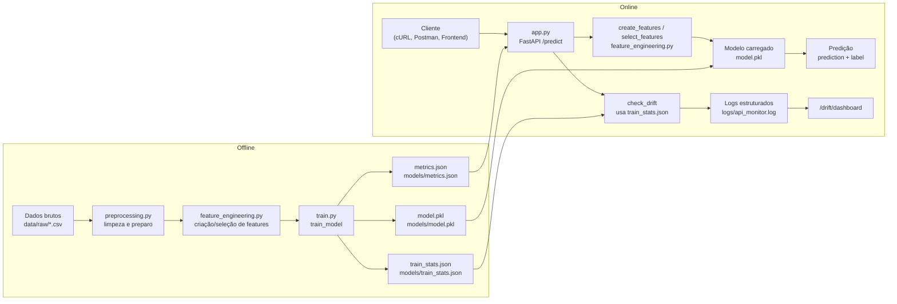

# Datathon: Case Passos Mágicos - Previsão de Risco de Defasagem Escolar

Projeto de Machine Learning Engineering para estimar risco de defasagem escolar de estudantes da Associação Passos Mágicos, cobrindo ciclo completo de MLOps: treinamento, validação, serving via API, testes, monitoramento e empacotamento com Docker.

## 1) Visão Geral do Projeto

**Objetivo de negócio**

Identificar, de forma antecipada, estudantes com maior probabilidade de risco educacional para apoiar ações pedagógicas e psicopedagógicas mais assertivas.

**Solução proposta**

Pipeline de ML em Python com:

- pré-processamento e limpeza de dados;
- engenharia e seleção de atributos;
- treinamento e avaliação de modelo supervisionado;
- serialização com `joblib`;
- disponibilização via API FastAPI (`/predict`);
- monitoramento com logs e painel de drift.

**Métrica principal de avaliação**

`F1-score` (com apoio de `accuracy`, `precision`, `recall` e `roc_auc` quando disponível). O F1-score equilibra precisão e recall, sendo adequado quando o foco é reduzir falsos negativos de alunos em risco sem gerar excesso de falsos positivos.

**Stack tecnológica**

- Linguagem: Python 3.9+
- ML: scikit-learn, pandas, numpy
- API: FastAPI + Uvicorn
- Serialização: joblib
- Testes: pytest + pytest-cov
- Empacotamento: Docker
- Monitoramento: logging + dashboard simples de drift
- Deploy: local (Docker) e pronto para cloud (Cloud Run/AWS/Heroku)

## 2) Estrutura do Projeto (Diretórios e Arquivos)

```bash
fiaptech5/
├── api/
│   ├── app.py                # Aplicação FastAPI e endpoints
├── data/
│   ├── raw/                  # Dados brutos (originais)
│   ├── processed/            # Dados limpos e preparados para treino
├── models/
│   ├── model.pkl             # Modelo treinado serializado
├── notebooks/                # Notebooks Jupyter para exploração e análise
├── src/
│   ├── preprocessing.py      # Funções de limpeza e tratamento inicial
│   ├── feature_engineering.py # Criação e seleção de variáveis
│   ├── train.py              # Pipeline de treinamento do modelo
│   ├── evaluate.py           # Avaliação de métricas
├── tests/
│   ├── test_pipeline.py      # Testes unitários
├── Dockerfile                # Arquivo para construção da imagem Docker
├── requirements.txt          # Dependências do projeto
└── README.md                 # Documentação do projeto
```

### 2.1) Diagrama da Arquitetura (offline + API)


### Executando com Docker (Recomendado)

1.  **Construir a imagem:**
    ```bash
    docker build -t passos-magicos-api .
    ```

2.  **Rodar o container:**
    ```bash
    docker run --rm -p 8000:8000 passos-magicos-api
    ```

### Executando localmente

1.  **Instalar dependências:**
    ```bash
    pip install -r requirements.txt
    ```

2.  **Treinar o modelo (necessário antes de rodar a API):**
    ```bash
    python src/train.py
    ```

   Opcional (definindo caminhos):

    ```bash
    python src/train.py data/raw/DATASET_FIAP.csv models/model.pkl
    ```

3.  **Iniciar a API:**
    ```bash
    uvicorn api.app:app --reload
    ```

4.  **Rodar os testes e cobertura:**
    ```bash
    pytest --cov=src --cov=api tests/
    ```

## 4) Exemplos de Chamadas à API

#### Interface Gráfica (Swagger UI)
Para facilitar a execução e testes, a aplicação conta com uma interface nativa.
1. Suba a aplicação (`uvicorn api.app:app --reload` ou via Docker).
2. Acesse no navegador: **`http://localhost:8000/docs`**
3. Você verá uma interface interativa para testar o endpoint `/predict` sem precisar de código.

### Via terminal (cURL)
**Endpoint:** `POST /predict`

**Exemplo com cURL:**
```bash
curl -X 'POST' \
  'http://localhost:8000/predict' \
  -H 'accept: application/json' \
  -H 'Content-Type: application/json' \
  -d '{
    "INDE": 7.5,
    "IDA": 8.0,
    "IEG": 7.0,
    "IAA": 8.5,
    "IPS": 7.0,
    "IPP": 7.5,
    "FASE": 2,
    "PEDRA": "Ametista"
}'
```

**Exemplo de Resposta:**
```json
{
    "prediction": 0,
    "label": "fora_do_grupo_de_risco",
    "drift_alerts": {}
}
```

**Outros endpoints úteis**

- `GET /health` (status da aplicação e carregamento do modelo)
- `GET /metrics` (métricas do último treino)
- `GET /drift` (informações de monitoramento)
- `GET /drift/dashboard` (painel HTML simples de drift)

## 4.1) Passo a passo para testar a aplicacao e endpoints

### 1) Preparar o ambiente

```bash
pip install -r requirements.txt
```

### 2) Treinar o modelo (gera `model.pkl` e estatisticas)

```bash
python src/train.py data/raw/DATASET_FIAP.csv models/model.pkl
```

### 3) Subir a API localmente

```bash
uvicorn api.app:app --host 127.0.0.1 --port 8000
```

### 4) Testar endpoints via curl

**Health check**

```bash
curl -X GET "http://127.0.0.1:8000/health"
```

**Metricas do ultimo treino**

```bash
curl -X GET "http://127.0.0.1:8000/metrics"
```

**Predicao**

```bash
curl -X POST "http://127.0.0.1:8000/predict" \
    -H "Content-Type: application/json" \
    -d "{"INDE":7.5,"IDA":8.0,"IEG":7.0,"IAA":8.5,"IPS":7.0,"IPP":7.5,"FASE":2,"PEDRA":"Ametista"}"
```

**Monitoramento de drift**

```bash
curl -X GET "http://127.0.0.1:8000/drift"
```

## 5) Etapas do Pipeline (Treinamento e Serviço)

Esta seção resume, de forma explícita, as duas pipelines que o case exige:

- **Pipeline de Treinamento (offline/orquestrada)**
- **Pipeline de Serviço (API em tempo real)**

### 5.1) Pipeline de Treinamento (offline)

Responsável por preparar os dados, treinar o modelo, avaliar desempenho e gerar os artefatos usados pela API.

**Scripts principais:**

- `src/preprocessing.py`: carregamento e limpeza de dados, geração de dataset sintético e preparação de dados reais.
- `src/feature_engineering.py`: criação de variáveis derivadas e seleção de features.
- `src/train.py`: orquestra todo o fluxo de treino, avaliação e salvamento.
- `src/evaluate.py`: cálculo de métricas de classificação.

**Etapas do fluxo de treinamento (`python src/train.py`):**

1. **Carregamento dos dados brutos**
    - Lê o arquivo principal informado (ex.: `data/raw/DATASET_FIAP.csv`).
    - Se o arquivo for inválido ou ausente, o script utiliza um **dataset sintético** gerado por `sample_data`.

2. **Pré-processamento e limpeza** (`preprocessing.py`)
    - Função `load_data`: suporta CSV, Excel e PDF (via extração de tabelas).
    - Função `clean_data`: normaliza nomes de colunas, remove duplicatas e mapeia colunas do PEDE para nomes padronizados (INDE, IDA, PEDRA etc.).
    - Função `prepare_real_data`: aplica a limpeza, seleciona colunas mais recentes, converte strings numéricas com vírgula para float e cria a coluna alvo `risk_label`.

3. **Engenharia de Atributos** (`feature_engineering.py`)
    - Função `create_features`: cria features derivadas, como `avg_performance` e `low_engagement`.
    - Função `select_features`: remove identificadores óbvios e organiza as colunas, mantendo `risk_label` como alvo.

4. **Split treino/teste e pipeline de modelagem** (`train.py`)
    - Divide o conjunto em `train` e `test` (20% para teste).
    - Constrói um `Pipeline` do scikit-learn com:
      - `ColumnTransformer` separando colunas numéricas e categóricas;
      - `SimpleImputer` + `StandardScaler` para numéricas;
      - `SimpleImputer` + `OneHotEncoder` para categóricas;
      - `RandomForestClassifier` como modelo final.

5. **Treinamento e avaliação**
    - Ajusta o modelo com os dados de treino.
    - Chama `evaluate_model` (`evaluate.py`) para calcular `accuracy`, `precision`, `recall`, `f1` e, quando possível, `roc_auc`.

6. **Seleção de modelo**
    - O modelo escolhido para este case é um **RandomForestClassifier**, por equilibrar boa performance, interpretabilidade razoável (importância de features) e facilidade de deploy em produção via scikit-learn.

7. **Salvamento de artefatos de MLOps**
    - Salva o pipeline completo (pré-processamento + modelo) em `models/model.pkl` via `joblib`.
    - Salva as métricas em `models/metrics.json`.
    - Calcula estatísticas de treino (médias das features numéricas) e salva em `models/train_stats.json`, usadas depois para **monitoramento de drift** na API.

> Observação: esta pipeline pode ser executada manualmente (`python src/train.py`) ou agendada (ex.: cron, Airflow) para re-treinar o modelo periodicamente com novos dados.

**Passo a passo prático da parte offline**

1. **Preparar ambiente**
     - Instalar dependências:
         ```bash
         pip install -r requirements.txt
         ```

2. **Organizar dados brutos**
     - Colocar os arquivos fornecidos pelo Datathon em `data/raw/` (por exemplo `DATASET_FIAP.csv`, `PEDE_PASSOS_2022.csv`, etc.).
     - Opcional: usar o notebook `[notebooks/1_download_and_explore.ipynb](notebooks/1_download_and_explore.ipynb)` para listar e explorar os arquivos da pasta `data/raw/`.

3. **Rodar o treinamento offline (pipeline completa)**
     - Treinar com **dataset sintético** (útil para smoke test rápido):
         ```bash
         python src/train.py
         ```
     - Treinar com o **dataset real do case**:
         ```bash
         python src/train.py data/raw/DATASET_FIAP.csv models/model.pkl
         ```

4. **Verificar artefatos gerados**
     - Após o treino, a pasta `models/` conterá:
         - `models/model.pkl` – pipeline completa (pré-processamento + modelo) usada pela API.
         - `models/metrics.json` – métricas de performance do modelo (accuracy, precision, recall, f1, roc_auc).
         - `models/train_stats.json` – médias das features numéricas usadas para monitoramento de drift.

5. **(Opcional) Analisar métricas e estatísticas no notebook**
     - No notebook `[notebooks/1_download_and_explore.ipynb](notebooks/1_download_and_explore.ipynb)`, há uma célula que:
         - Carrega `models/metrics.json` e imprime as métricas do modelo.
         - Carrega `models/train_stats.json` e plota um gráfico de barras com as estatísticas de treino.

6. **(Opcional) Monitorar drift em lote**
     - Para avaliar drift em um CSV de entradas recentes, usar o script `[src/monitor_drift.py](src/monitor_drift.py)`:
         ```bash
         python src/monitor_drift.py data/processed/recent_inputs.csv \
                        --train-stats-path models/train_stats.json \
                        --output-dir logs
         ```
     - Isso gera um relatório JSON em `logs/` com as features que ultrapassaram o threshold de 30% na média.

### 5.2) Pipeline de Serviço (API em tempo real)

Responsável por expor o modelo treinado para consumo via HTTP.

**Componente principal:**

- `api/app.py`: aplicação FastAPI com endpoints `/health`, `/predict`, `/metrics`, `/drift` e `/drift/dashboard`.

**Etapas do fluxo da API (em alto nível):**

1. **Inicialização da aplicação**
    - Na inicialização (lifespan), a API:
      - Carrega `models/model.pkl`.
      - Carrega `models/train_stats.json` para suporte ao monitoramento de drift.
      - Se o modelo não existir ou falhar, treina um **modelo fallback em memória** usando `sample_data`, `create_features` e `select_features`.

2. **Recebimento de requisição de predição (`POST /predict`)**
    - O corpo da requisição é validado pelo modelo Pydantic `StudentData`, que aceita campos como `INDE`, `IDA`, `IEG`, `IAA`, `IPS`, `IPP`, `FASE`, `PEDRA` e campos extras.
    - Os dados de entrada são convertidos para um `DataFrame` de uma linha.

3. **Engenharia de atributos na entrada**
    - A API reaplica `create_features` e `select_features` sobre o `DataFrame` recebido, garantindo que o formato fique compatível com o pipeline treinado.

4. **Predição do modelo**
    - O pipeline carregado (`model.pkl`) recebe o `DataFrame` processado e retorna a classe prevista (`0` ou `1`).
    - A resposta inclui o campo `prediction` com a classe prevista.

5. **Monitoramento de drift e logging**
    - A função `check_drift` compara as médias da entrada com as médias salvas em `train_stats.json`.
    - Se houver variação acima de 30%, registra alertas de drift em `logs/api_monitor.log`.
    - O endpoint `/drift/dashboard` lê esses logs e exibe um painel HTML simples com os últimos alertas.

6. **Exposição de métricas e saúde da aplicação**
    - `/metrics`: retorna as métricas salvas em `models/metrics.json` geradas pela pipeline de treinamento.
    - `/health`: indica se a aplicação está saudável e se o modelo foi carregado com sucesso.

7. **Pós-processamento da predição**
    - A resposta da API encapsula o resultado do modelo e informações de monitoramento em um JSON estruturado com os campos principais:
      - `prediction`: classe prevista pelo modelo (0 ou 1 – risco de defasagem).
      - `drift_alerts`: dicionário com eventuais alertas de drift para as features monitoradas.
    - Esse formato facilita o consumo por outras aplicações e dashboards.

> Em produção, essa pipeline é empacotada via Docker (`Dockerfile`) e pode ser executada em qualquer ambiente que suporte containers, mantendo o fluxo de predição totalmente automatizado a partir de `model.pkl`.

### 5.3) Monitoramento Contínuo (Logging e Drift)

O projeto implementa monitoramento contínuo em dois níveis: **logging estruturado** e **verificação de drift**.

**Logging estruturado na API**

- A API utiliza um `RotatingFileHandler` que grava logs em `logs/api_monitor.log`.
- Cada evento relevante é registrado em **formato JSON** (um objeto por linha), incluindo:
    - `model_loaded`, `model_load_error`, `model_fallback_built`;
    - `train_stats_loaded`, `train_stats_load_error`;
    - `prediction` (entrada, saída, timestamp);
    - `drift_alert` (diferenças detectadas entre dados atuais e estatísticas de treino);
    - `prediction_error` e `prediction_exception`.
- Isso facilita o consumo dos logs por ferramentas de observabilidade (ex.: ELK, Datadog, Cloud Logging).

**Monitoramento de drift via API**

- Durante cada chamada a `/predict`, a função `check_drift` compara as médias das features de entrada com as médias salvas em `models/train_stats.json`.
- Se a variação relativa de alguma feature exceder **30%** em relação ao treino, é gerado um evento `drift_alert` no log estruturado.
- O endpoint `/drift/dashboard` lê `logs/api_monitor.log` e mostra, em HTML, um resumo dos últimos alertas, funcionando como um painel simples de monitoramento.

**Script de monitoramento de drift (batch/offline)**

Além do monitoramento em tempo real na API, há um script dedicado em [`src/monitor_drift.py`](src/monitor_drift.py) que pode ser agendado (cron, Airflow, etc.).

- Entrada: um arquivo CSV com dados recentes de entrada (ex.: amostra de requests coletadas).
- Referência: `models/train_stats.json`, gerado pela pipeline de treinamento.
- Saída: um relatório JSON de drift salvo em `logs/`, contendo as features analisadas e as que ultrapassaram o threshold de 30%.

Exemplo de uso:

```bash
python src/monitor_drift.py data/processed/recent_inputs.csv \
        --train-stats-path models/train_stats.json \
        --output-dir logs
```

Esse componente atende ao requisito de **monitoramento contínuo**, permitindo acompanhar a estabilidade dos dados tanto em tempo real (via API) quanto em análises periódicas em lote.


**Painel de drift (HTML)**

Abra no navegador: `http://127.0.0.1:8000/drift/dashboard`

### 5) Rodar testes automatizados

```bash
pytest --cov=src --cov=api tests/
```

## 5) Etapas do Pipeline de Machine Learning

1. **Pré-processamento (`src/preprocessing.py`)**
    - carga de CSV/Excel com fallback de encoding/separador;
    - limpeza de duplicidades e padronização básica;
    - preparação de features/target com criação de `risk_label`.

2. **Engenharia de features (`src/feature_engineering.py`)**
    - criação de variáveis derivadas (ex.: média de desempenho, flag de baixo engajamento);
    - seleção de atributos para modelagem.

3. **Treinamento e validação (`src/train.py`)**
    - pipeline com `ColumnTransformer` + `RandomForestClassifier`;
    - split treino/teste e avaliação;
    - persistência do modelo e métricas.

4. **Avaliação (`src/evaluate.py`)**
    - cálculo de `accuracy`, `precision`, `recall`, `f1` e `roc_auc` quando possível.

5. **Pós-processamento e serving (`api/app.py`)**
    - inferência via API REST;
    - monitoramento de drift por comparação estatística e logs.

## 6) Monitoramento Contínuo

- Logs rotativos em `logs/api_monitor.log`.
- Detecção de drift no endpoint `/predict` comparando média do input com estatísticas de treino (`models/train_stats.json`).
- Painel simples em `/drift/dashboard` com total e últimos alertas.

## 7) Artefatos da Entrega

- Código-fonte modularizado neste repositório.
- Documentação neste `README.md`.
- API local: `http://localhost:8000` (subir com Docker ou localmente).
- Vídeo gerencial (até 5 minutos): inserir link final na entrega do grupo.
